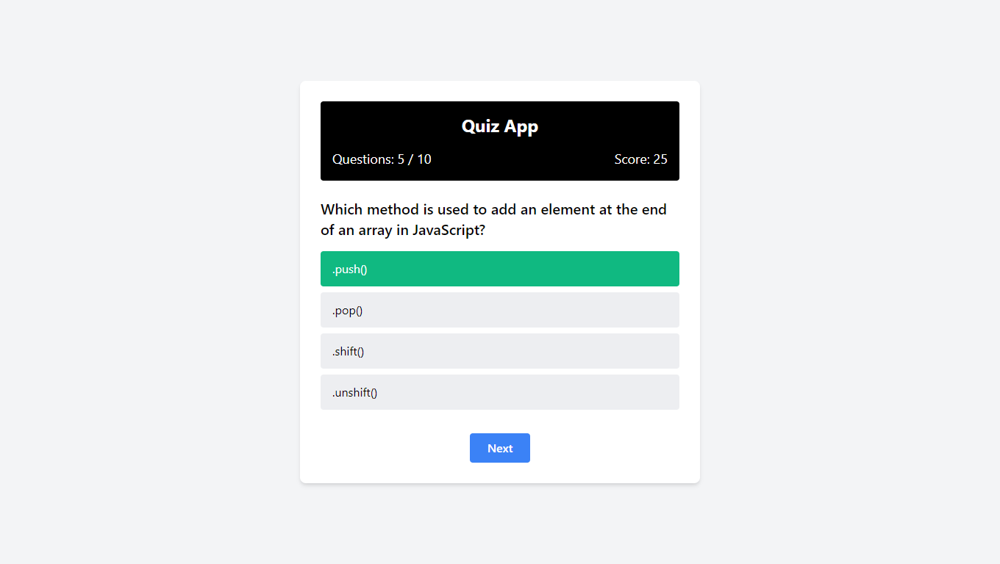

## Quiz App

A simple quiz application built using HTML, Tailwind CSS, and JavaScript. This project features a 10-question quiz where users can test their knowledge on various topics, score points for correct answers, and view their results at the end. Users can also restart the quiz to try again.

## Technologies Used

- HTML: Provides the structure of the application.
- Tailwind CSS: Handles the styling and layout with utility-first classes.
- JavaScript: Manages the quiz logic, including question navigation, score calculation, and result display.

## Website Link

[Quiz App](https://himanshu-paliwal-277.github.io/Quiz-App-In-JS/)

## Project Screenshot

